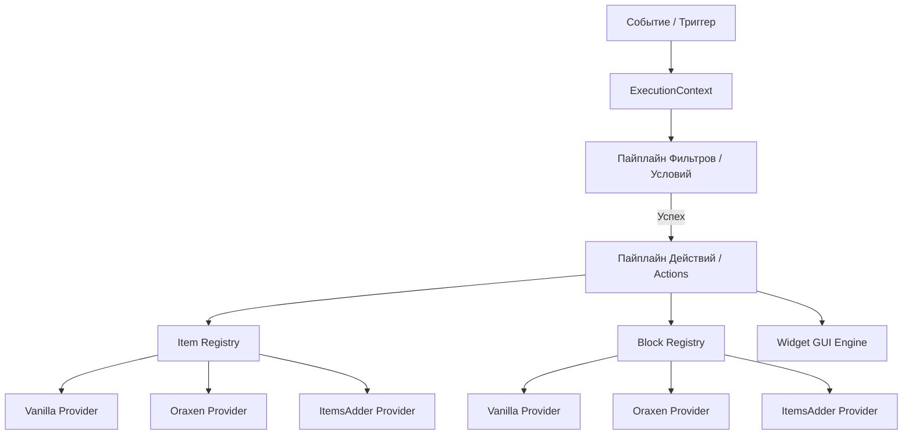

# 🏛️ Архитектура ActionsAndTriggers (AAT) Core

## 1. Введение и Миссия проекта
**ActionsAndTriggers (AAT)** — это ультимативный корпоративный фреймворк для Paper/Purpur серверов (версии `>= 1.21.4` и `26.2+`), созданный для объединения игровых событий, декларативных действий, интерактивных GUI-интерфейсов и автоматизации кастомных блоков/машин в единую экосистему без необходимости использования десятков разрозненных плагинов.

Фреймворк работает на **чистом Paper API** без привлечения нестабильного NMS (Net Minecraft Server) кода, что гарантирует полную бинарную и логическую совместимость между минорными и мажорными апдейтами ядра сервера.

---

## 2. Ключевые архитектурные сущности

### 2.1. Контекст исполнения (`ExecutionContext`)
`ExecutionContext` — это иммутабельный контейнер данных, порождаемый триггером и передаваемый через всю цепочку обработки:
- Содержит типизированные ключи (`CoreKeys`):
  - `PLAYER`: Игрок, вызвавший событие (`org.bukkit.entity.Player`).
  - `LOCATION`: Координаты события (`org.bukkit.Location`).
  - `BLOCK`: Взаимодействующий блок (`org.bukkit.block.Block`).
  - `ITEM`: Предмет в руке или взаимодействии (`org.bukkit.inventory.ItemStack`).
  - `FROM_WORLD`, `TO_WORLD`, `WORLD`: Миры взаимодействия.
  - `CANCEL_CONSUMER`: Лямбда для отмены базового Bukkit события (`Cancellable`).
- Поддерживает произвольные метаданные сессии и локальные переменные.

### 2.2. Провайдеры предметов и блоков (`ItemRegistry`, `BlockRegistry`)
Фреймворк полностью абстрагирует разработчика от конкретных систем кастомных предметов:
- Синтаксис идентификаторов: `<namespace>:<id>`.
  - `minecraft:diamond_sword` $\rightarrow$ Ванильный провайдер (`VanillaItemProvider`).
  - `oraxen:astral_atlas` $\rightarrow$ Провайдер Oraxen (`OraxenItemProvider`).
  - `itemsadder:ruby_sword` $\rightarrow$ Провайдер ItemsAdder (`ItemsAdderItemProvider`).
- Провайдеры умеют:
  1. `resolveItem(id)`: Создавать готовый `ItemStack` со всеми тегами, CustomModelData и компонентами.
  2. `getFullId(itemStack)`: Определять исходный ID предмета (например, опознать кастомный меч Oraxen в инвентаре).
  3. `isCustomBlock(block)` / `getBlockId(block)`: Определять механику блоков в мире.

---

## 3. Реестры и Жизненный цикл

1. **Регистрация парсеров**: При старте плагина через рефлексию сканируются классы-парсеры:
   - `DefaultActionParsers`: аннотации `@ConfigAction("core:...")` с метаданными `@ActionParam`.
   - `DefaultFilterParsers`: аннотации `@ConfigFilter("core:...")`.
   - `TriggerRegistry`: регистрация слушателей Bukkit событий (`BukkitEventTrigger`).
2. **Загрузка конфигураций**:
   - `triggers/*.yml` $\rightarrow$ считывание YAML-триггеров, компиляция деревьев условий и списков действий.
   - `guis/*.yml` $\rightarrow$ считывание масок, виджетов и шаблонов окон.
3. **Горячая перезагрузка (`/aat reload`)**:
   - Полный сброс зарегистрированных конфигов, повторное сканирование файлов без перезапуска JVM.

---

## 4. Потокобезопасность и Производительность
- Все базовые операции чтения реестров кэшируются в `ConcurrentHashMap`.
- Обработка асинхронных событий (например, `AsyncChatEvent`) изолирована от операций мутации инвентарей через планировщик `Bukkit.getScheduler().runTask(plugin, ...)`.
- Создание `MiniMessage` компонентов оптимизировано с использованием единого синглтона `MiniMessage.miniMessage()`.
