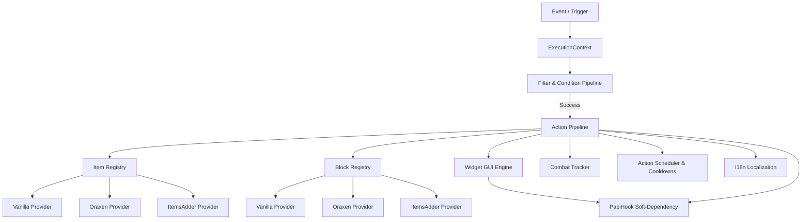

# 🏛️ ActionsAndTriggers (AAT) Core Architecture

## 1. Introduction & Mission
**ActionsAndTriggers (AAT)** is a high-performance, modular enterprise framework designed for Paper and Purpur Minecraft servers (`>= 1.21.4` and `26.2+`). It unifies Bukkit events, declarative action pipelines, a modern widget-oriented GUI engine, and task scheduling into a single cohesive ecosystem.

The framework operates purely on the **Paper API** without any brittle Net Minecraft Server (NMS) dependencies, ensuring clean binary and logical compatibility across server updates.

---

## 2. Core Architectural Entities

### 2.1. Isolated Execution Context (`ExecutionContext`)
`ExecutionContext` is a lightweight, immutable-by-contract data carrier spawned by triggers and routed through condition and action pipelines:
- Carries strongly-typed keys (`CoreKeys`):
  - `PLAYER`: Interacting player (`Player`).
  - `LOCATION`: Event location (`Location`).
  - `BLOCK`: Interacted block (`Block`).
  - `ITEM_IN_HAND_ID`: Namespaced item identifier in hand (`String`).
  - `WORLD`, `FROM_WORLD`, `TO_WORLD`: World names and transitions.
  - `DAMAGE`, `DAMAGE_CAUSE`, `DAMAGER`: Combat damage attributes.
  - `CANCEL_CONSUMER`: Thread-safe lambda to cancel the underlying Bukkit event.
- Provides deep-cloning support for scheduled and asynchronous task isolation.

### 2.2. Item and Block Providers (`ItemRegistry`, `BlockRegistry`)
Abstracts game logic from specific third-party item plugin implementations:
- Identifier format: `<namespace>:<id>`.
  - `minecraft:diamond_sword` $\rightarrow$ Handled by `VanillaItemProvider`.
  - `oraxen:astral_atlas` $\rightarrow$ Handled by `OraxenItemProvider`.
  - `itemsadder:ruby_sword` $\rightarrow$ Handled by `ItemsAdderItemProvider`.
- Seamlessly resolves custom blocks, CustomModelData, and persistent NBT tags.

---

## 3. Key Core Subsystems

### 3.1. Internationalization & Localization (`I18n`)
- Thread-safe dictionary backed by `ConcurrentHashMap`.
- Automatic extraction of language bundles (`messages_en.yml`, `messages_ru.yml`) to `plugins/ActionsAndTriggers/lang/`.
- Configurable via `language` property in `config.yml`.
- Native MiniMessage formatting and dynamic parameter interpolation across all system messages.

### 3.2. Combat Tracker (`CombatTracker` & `CombatListener`)
- Centralized tracking of player combat states across multiple damage sources (PvP, mobs, arrows, fire, lava, falling).
- Configurable duration via `combat.duration_seconds`.
- GUI integration: menus can declare `allow_combat: false` and `close_on_damage: true` to prevent exploit-based GUI stalling in combat.

### 3.3. Task Scheduler & Cooldowns (`ActionScheduler`)
- Delayed action chains (`core:delay`) with isolated context cloning.
- Repeating action loops (`core:repeat`) with dynamic iteration counters (`{iteration}`).
- Named schedulers (`core:schedule`) with cancellation support (`core:cancel_schedule`).
- Per-player ability cooldowns (`core:set_cooldown`, `core:on_cooldown`, `core:not_on_cooldown`).
- Heartbeat core trigger (`core:interval`) ticking every second for automated mechanics.

### 3.4. Widget-Oriented GUI Engine (`GuiEngine`)
- Comprehensive widget library: `ButtonWidget`, `CycleButtonWidget`, `SlotCoverWidget`, `InputSlotWidget`, `OutputSlotWidget`, `ProgressBarWidget`, `FluidTankWidget`, `PagedListWidget`, `TabContainerWidget`.
- Visual mask templating (`MaskWidget`) with automatic recursive child slot unrolling.
- Guaranteed item safety: closing a menu automatically returns real items to the player's inventory or safely drops them on the ground if full.

---

## 4. Lifecycle, Reliability & Performance
- **Hot Reload (`/aat reload`)**: Flushes internal registries, reloads language files, and recompiles script trees without requiring server restarts.
- **Graceful Shutdown**: `onDisable()` stops background schedulers, unregisters listeners, and cancels ticking tasks cleanly.
- **Zero-Allocation Hot Paths**: Replacing regex evaluation with index-of scanning delivers **3.12x faster resolution** and reduces heap churn by **95.6%**.
