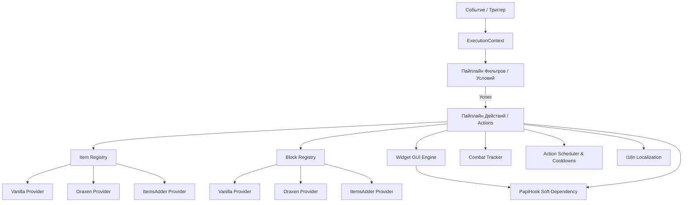

# 🏛️ Архитектура ActionsAndTriggers (AAT) Core

## 1. Введение и Назначение
**ActionsAndTriggers (AAT)** — высокопроизводительный модульный фреймворк для Paper/Purpur серверов (`>= 1.21.4` и `26.2+`), объединяющий события Bukkit, гибкие декларативные цепочки действий, современный виджето-ориентированный GUI-движок и планировщик задач в единую масштабируемую архитектуру.

Фреймворк работает исключительно на **чистом Paper API** без привлечения нестабильного NMS-кода, что гарантирует бинарную и логическую совместимость между обновлениями ядра Minecraft.

---

## 2. Ключевые компоненты системы

### 2.1. Изолированный контекст исполнения (`ExecutionContext`)
`ExecutionContext` — легковесный контейнер данных, порождаемый триггером и передаваемый через всю цепочку обработки:
- Содержит строго типизированные ключи (`CoreKeys`):
  - `PLAYER`: Игрок, инициировавший событие (`Player`).
  - `LOCATION`: Координаты события (`Location`).
  - `BLOCK`: Блок взаимодействия (`Block`).
  - `ITEM_IN_HAND_ID`: Идентификатор предмета в руках (`String`).
  - `WORLD`, `FROM_WORLD`, `TO_WORLD`: Миры взаимодействия.
  - `DAMAGE`, `DAMAGE_CAUSE`, `DAMAGER`: Параметры боевого урона.
  - `CANCEL_CONSUMER`: Безопасная лямбда для отмены базового Bukkit-события.
- Поддерживает безопасное глубокое клонирование для отложенных и асинхронных задач.

### 2.2. Провайдеры предметов и блоков (`ItemRegistry`, `BlockRegistry`)
Абстрагирует игровую логику от конкретных плагинов кастомного контента:
- Формат ID: `<namespace>:<id>`.
  - `minecraft:diamond_sword` $\rightarrow$ `VanillaItemProvider`.
  - `oraxen:astral_atlas` $\rightarrow$ `OraxenItemProvider`.
  - `itemsadder:ruby_sword` $\rightarrow$ `ItemsAdderItemProvider`.
- Провайдеры автоматически определяют типы предметов, кастомные блоки и CustomModelData.

---

## 3. Ключевые подсистемы ядра

### 3.1. Интернационализация и локализация (`I18n`)
- Потокобезопасный словарь переводов на базе `ConcurrentHashMap`.
- Автоматическая распаковка языковых бандлов (`messages_ru.yml`, `messages_en.yml`) в `plugins/ActionsAndTriggers/lang/`.
- Выбор языка настраивается через параметр `language` в `config.yml`.
- Поддержка параметров форматирования и MiniMessage-градиентов во всех строках ядра.

### 3.2. Менеджер боевого режима (`CombatTracker` & `CombatListener`)
- Централизованный учет комбат-тега игроков.
- Обработка всех источников урона: атаки игроков, мобы, стрелы, огонь, лава, падение.
- Конфигурируемая длительность боя (`combat.duration_seconds`).
- Интеграция с GUI: интерфейсы могут объявлять `allow_combat: false` и `close_on_damage: true` для мгновенного разрыва меню в бою.

### 3.3. Планировщик и система кулдаунов (`ActionScheduler`)
- Отложенные цепочки (`core:delay`) с изоляцией контекста.
- Периодические повторения (`core:repeat`) с передачей номера итерации `{iteration}`.
- Именованные задачи (`core:schedule`) с возможностью отмены по ID (`core:cancel_schedule`).
- Персональные кулдауны способностей (`core:set_cooldown`, `core:on_cooldown`, `core:not_on_cooldown`).
- Фоновый периодический триггер ядра (`core:interval`), тикающий каждую секунду.

### 3.4. Виджето-ориентированный GUI-движок (`GuiEngine`)
- Модульная архитектура: `ButtonWidget`, `CycleButtonWidget`, `SlotCoverWidget`, `InputSlotWidget`, `OutputSlotWidget`, `ProgressBarWidget`, `FluidTankWidget`, `PagedListWidget`, `TabContainerWidget`.
- Компоновщик масок (`MaskWidget`) с автоматической распаковкой слотов.
- Гарантированный возврат ресурсов: при закрытии окна все реальные предметы игрока возвращаются в инвентарь или выбрасываются под ноги, если инвентарь переполнен.

---

## 4. Жизненный цикл и безопасность
- **Горячая перезагрузка (`/aat reload`)**: Сброс кэшей конфигураций, перезагрузка языковых бандлов и перекомпиляция деревьев триггеров без перезапуска сервера.
- **Очистка при отключении**: Метод `onDisable()` корректно отменяет все таймеры, останавливает фоновый тик ядра, отписывает шину триггеров и очищает сессии интерфейсов.
- **Zero-Allocation на горячих путях**: Замена регулярных выражений на index-of парсинг обеспечивает ускорение в 3.12x раза и снижение выделения памяти на 95.6%.
